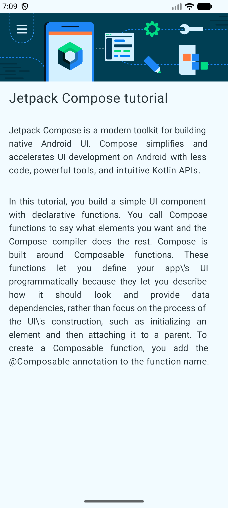

# Jetpack Compose Tutorial 📱

  <a href="#portugues">Português</a> • 
  <a href="#english">English</a>

---

## 🇺🇸 English Version

### 📍 Quick Navigation
- [Features](#-features-en)
- [Technologies](#-technologies-en)
- [Demonstration](#-demonstration-en)
- [Key Learnings](#-learnings-en)

<h3 id="features-en">🚀 Features</h3>

- Header image display with dynamic scaling.
- Vertical layout organization using `Column`.
- Text formatting with different font sizes and alignments.
- Adaptive layout respecting device safe areas (`Scaffold`).

<h3 id="technologies-en">🛠️ Technologies Used</h3>

- **Kotlin**: Primary language.
- **Jetpack Compose**: Modern toolkit for building native UI.
- **Material Design 3**: UI design standards.

<h3 id="demonstration-en">📸 App Demonstration</h3>

<h3 id="learnings-en">📖 Key Learnings</h3>

During this exercise, the following concepts were applied:
- Resource management using `painterResource`.
- Element positioning and styling with `Modifier`.
- Usage of fundamental composables: `Image`, `Text`, and `Column`.

## 🇧🇷 Versão em Português

### 📍 Navegação rápida

- [Funcionalidades](#-funcionalidades-pt)
- [Tecnologias](#-tecnologias-pt)
- [Demonstração](#-demonstração-pt)
- [Aprendizado](#-aprendizado-pt)

<h3 id="funcionalidades-pt">🚀 Funcionalidades</h3>

- Exibição de imagem de cabeçalho com redimensionamento dinâmico.
- Organização de layout vertical utilizando `Column`.
- Formatação de textos com diferentes tamanhos de fonte e alinhamentos.
- Layout adaptável que respeita as áreas seguras do dispositivo (`Scaffold`).

<h3 id="tecnologias-pt">🛠️ Tecnologias Utilizadas</h3>

- **Kotlin**: Linguagem principal.
- **Jetpack Compose**: Toolkit moderno para construção de UI nativa.
- **Material Design 3**: Padrões de design de interface.

<h3 id="demonstração-pt">📸 Demonstração do Aplicativo</h3>

<h3 id="aprendizado-pt">📖 O que foi aprendido</h3>

Durante o desenvolvimento deste exercício, foram aplicados conceitos de:
- Gerenciamento de recursos (`painterResource`).
- Posicionamento de elementos com `Modifier`.
- Uso de composables fundamentais como `Image`, `Text` e `Column`.

---

[Back to top](#jetpack-compose-tutorial-)